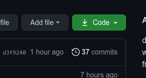
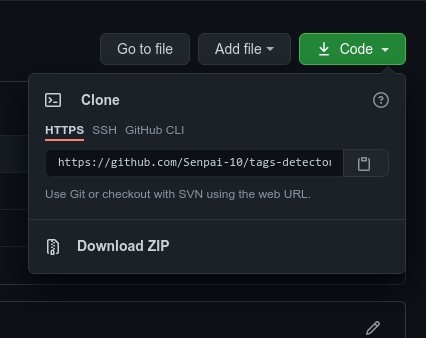
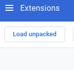
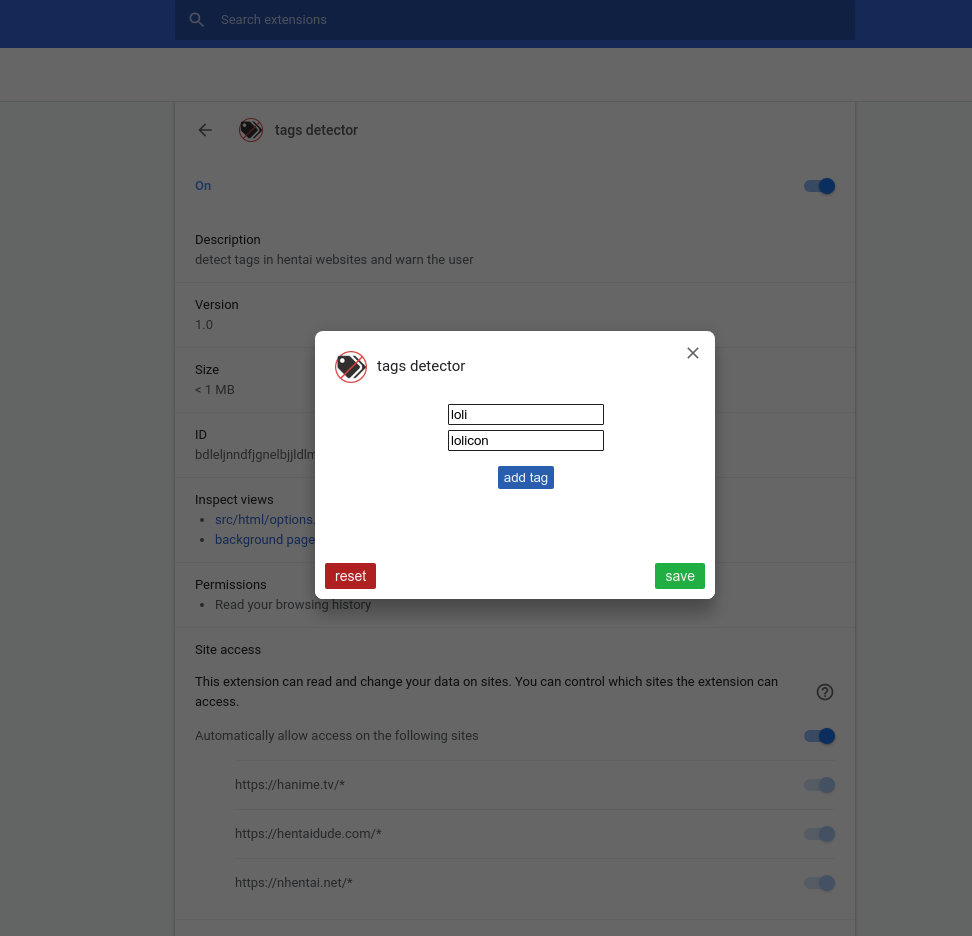
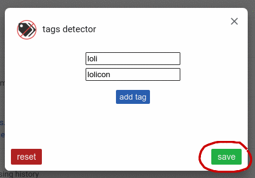

## **Table of contents**
1. [**websites**](#Tags-detector-websites)
2. [**installation**](#Installation)
    * [**chrome**](#chrome)
3. [**usage**](#usage)

---

</img>

## **Tags detector websites**

1. [nhentai.net](https://www.nhentai.net)
2. [hentaidude.com](https://hentaidude.com)
3. [hanime.tv](https://hanime.tv)
4. [hentai.tv](https://hentai.tv)

# Installation
how to install.

## **Chrome**
- First click the green button

- Then click Download ZIP

- unzip the downloaded file

- write chrome://extensions/ into your address bar

- enable the developer mode (top right corner)

- press the "Load Unpacked" button (top left corner)

- go inside the unzipped extension folder and press "Select a folder"

## **Usage**
- Go to extension options

- Add tags you don't like

 
 
 

- **Click the save button**

- now you can open any hentai website from the [websites list](#Tags-detector-websites)

